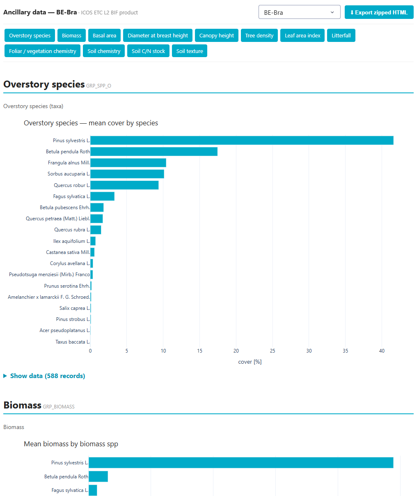

# ICOS Ancillary Data Viewer

An interactive web app that presents **ICOS ETC L2 ancillary (BADM) data** for any
ecosystem station as clean charts and tables — a Python reimagining of the
[ETC_PROCESSING_SUITE](https://github.com/ArneIserbyt/ETC_PROCESSING_SUITE) R Markdown
reports, built to run as a single parametrized service (e.g. embedded in the
[ICOS Carbon Portal](https://data.icos-cp.eu)) instead of one static page per site.



## What it does

- Takes a **station code** or an **archive PID** as a URL parameter and renders every
  variable group that station actually reported.
- **Data-driven**: works for forest, grassland, cropland and wetland stations alike —
  a grassland simply has no tree groups, a forest has no `GRP_SPP` cover group, etc.
- **Curated soil/chemistry views**: soil chemistry & C/N stock as depth profiles, soil
  texture as stacked fractions by depth, foliar chemistry as per-element small-multiples,
  species as percent-cover bars. Everything else uses a sensible generic "mean by category".
- **No-parameter mode**: shows a dropdown of all stations that have ancillary archives.
- **Export**: one click bundles a self-contained, interactive HTML snapshot into a zip.
- **Iframe-ready**: sends a `frame-ancestors` CSP so the Carbon Portal can embed it.

## Quickstart (local, no Docker)

```bash
python -m venv .venv && .venv/Scripts/pip install -r requirements.txt
python app.py
# open http://localhost:8050/                 -> station dropdown
#      http://localhost:8050/?station=DE-Gri   -> a grassland site
#      http://localhost:8050/?pid=<archivePID> -> by data-object PID
```

For Docker / production, see **[deployment.md](deployment.md)**.

## How the data flows

```
ETC L2 ARCHIVE (.zip on the Carbon Portal)
   └─ extractFile  ──►  ICOSETC_<site>_ANCILLARY_L2.csv   (BADM "BIF" long format)
                                   │  SITE_ID, GROUP_ID, VARIABLE_GROUP, VARIABLE, DATAVALUE
        bif_parser.group_wide      ▼
                          one tidy table per variable group
        ancillary_lib.figure_for   ▼
                          Plotly figure + summary table  (curated or generic)
        app.py / Dash              ▼
                          interactive page  +  zipped-HTML export
```

The per-variable-group pivot replaces the R suite's manual "BIF → BIFTAB" Colab step.
Data is fetched with [`icoscp_core`](https://pypi.org/project/icoscp-core/) and cached
locally; metadata lookups need no auth, data extraction needs a session (see deployment.md).

## Project structure

| File | Role |
|------|------|
| `app.py` | Dash app: URL params, station dropdown, all-groups rendering, zip export, iframe CSP |
| `ancillary_lib.py` | core: resolve station/PID → data, build Plotly figures (curated + generic), info-card fallback |
| `bif_parser.py` | parse BADM BIF long format → tidy long + per-group wide tables (+ optional Parquet export) |
| `BIF_Ancillary_Variables.csv` | station-independent variable dictionary (names, descriptions, units) |
| `cache/` | cached `ICOSETC_<site>_ANCILLARY_L2.csv` files + `stations.json` |
| `Dockerfile`, `docker-compose*.yml`, `requirements.txt` | deployment (see deployment.md) |
| `bif_parser.py` Parquet output (`parquet/`) | optional: tidy + per-group Parquet for direct data reuse |
| `build_report.py` | legacy static (matplotlib) HTML report — superseded by the Dash app + export |

## Variable groups handled

Curated: `GRP_SOIL_CHEM`, `GRP_SOIL_STOCK` (depth profiles), `GRP_SOIL_TEX` (texture
fractions), `GRP_VEG_CHEM` (foliar elements), `GRP_SPP`/`GRP_SPP_O` (species cover).
Generic charts: `GRP_BIOMASS`, `GRP_BASAL_AREA`, `GRP_DBH`, `GRP_HEIGHTC` (canopy height),
`GRP_TREES_NUM`, `GRP_LAI`, `GRP_LITTER`, `GRP_SOIL_DEPTH`. Chart-less classification groups
(`GRP_SOIL_CLASSIFICATION`, `GRP_SOIL_WRB_GROUP`) render as info tables. Unknown groups get a
humanized title and the generic renderer automatically.

## License

Code in this repository is licensed under the **GNU General Public License v3.0** — see
[LICENSE](LICENSE).

## Citing the data

Ancillary data are © ICOS and distributed under **CC-BY-4.0** (separate from the code license).
Please cite and acknowledge ICOS, and reference the specific station's L2 archive (DOI/PID on
the Carbon Portal).
